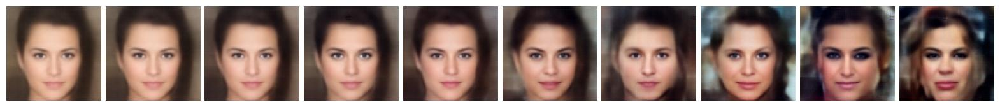

# Sampling with VAE-GAN

This repository demonstrates **sampling and controlled variation using a pre-trained VAE-GAN model** on the CelebA dataset.
The goal is to encode an input facial image into the latent space, generate multiple diverse but domain-consistent images, and visualize the results.

## Project Description

* **Encoder**: Maps input image → latent vector (`z`).
* **Latent Sampling**: Apply interpolation between the original latent vector (`z_anchor`) and a random latent vector (`z_rand`) to generate smooth and controlled variations.
* **Decoder (Generator)**: Reconstructs images from the sampled latent codes.
* **Output**: Produces **10 diverse images** from a single input.

This project is **not identity-preserving** — the generated images belong to the same domain but not necessarily the same person.

## Requirements

Install the dependencies before running:

```bash
pip install numpy matplotlib scipy pillow tensorflow==1.15
```

> The code is based on **TensorFlow 1.x**, so you may need to set up a compatible environment (e.g., Anaconda).


## Repository Structure

```
├── VAEGAN_sampling.py     # Main script (encode → sample → decode)
├── make_network.py        # Network architecture (imported by main script)
├── utils.py               # Utility functions (preprocessing, normalization)
├── vaegan_celeba.ckpt     # Pretrained checkpoint (not included, add manually)
├── results/               # Generated output images
└── README.md              # Documentation
```


## How to Run

1. Place the pretrained checkpoint `vaegan_celeba.ckpt` in the project root directory.
   (If not available, training needs to be redone — checkpoint not included here due to size.)

2. Run sampling from an input image:

```bash
python VAEGAN_sampling.py -i assets/example.jpg
```

3. The script will:

   * Encode the input into latent space.
   * Generate **10 diverse samples** using interpolation between anchor and random vectors.
   * Save all generated images individually in `results/`.
   * Save a **grid collage** (`collage.jpg`) for quick visualization.


## Experimental Results

* The generated images demonstrate smooth variation when interpolating between latent vectors.
* Interpolation (instead of adding raw Gaussian noise) provides **more realistic and controlled results**.
* Example:

**Input → 10 Generated Samples (Grid Collage):**



## Checkpoint Limitations

* The pretrained `vaegan_celeba.ckpt` may not be well-trained → reconstructions are **blurry even without noise**.
* Some checkpoints are trained at **low resolution (e.g., 64×64)** but resized to 128×128 → causing inherent blur.
* Using **modern architectures** like **StyleGAN2, VQ-VAE, or improved VAE-GANs** with longer training would produce sharper, higher-fidelity images.


## Author

* **Osama Sleem**
* AI Researcher | Computer Vision | Generative Models
* [GitHub](https://github.com/ossmjm) | [LinkedIn](https://www.linkedin.com/in/osama-sleem-9b1102236/)

## Acknowledgements

This project reuses the pretrained **VAE-GAN CelebA checkpoint** provided by the authors of the original implementation:

* GitHub Repository: [https://github.com/rufinv/VAE-GAN-CelebA](https://github.com/rufinv/VAE-GAN-CelebA)
* Paper: **Reconstructing Faces from fMRI Patterns using Deep Generative Neural Networks** by VanRullen & Reddy (2019)

All rights for the pretrained model belong to the original authors. This repository only demonstrates **sampling and experimentation** on top of their released weights.
